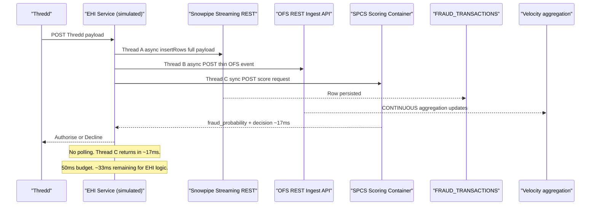

# Plan: nb06_latency_proof.ipynb

## Context

### Customer Architecture (from diagram)
- **Thredd** is the card processor. Every payment arrives as a Thredd webhook to the EHI service via AWS Elastic Load Balancing.
- `Cust_Ref: "ZLCH00012345"` — the "ZLCH" prefix confirms this is Zilch's live payload format.
- The EHI service does "all the checks" and then makes **two polling attempts** to read the fraud result before returning Authorise/Decline to Thredd.
- The acquirer is **checkout.com**.
- The total latency budget shown in the diagram: **< 50ms** for the full EHI round-trip.

### The Async Polling Problem
Their fraud scoring is **async with polling**, not synchronous. The EHI service fires a fraud check request, continues other checks, then polls once (Attempt 1), then polls again (Attempt 2) if the result is not ready. This means:
- If the model is slow, both polling attempts miss and they either proceed without a score or decline defensively.
- The polling overhead itself (two HTTP round-trips) consumes latency budget even when the model is fast.

Our architecture eliminates polling entirely. Thread C (SPCS scoring) is synchronous — it blocks for ~17ms and returns. No polling, no missed attempts, no defensive fallback.

### Thredd Payload → Our Data Model

The full Thredd event is what gets ingested via Snowpipe Streaming. The thin OFS event is derived from it. The `IP_ADDRESS` field is not in the Thredd payload — it comes from the app layer (device fingerprint / session enrichment) and is included when the EHI service constructs the OFS event.

```
Thredd field          → FRAUD_TRANSACTIONS column    → OFS event field
──────────────────────────────────────────────────────────────────────
Cust_Ref              → CUSTOMER_ID                  → CUSTOMER_ID
Token                 → WALLET_DPAN                  → WALLET_DPAN (str)
Merch_ID_DE42         → MERCHANT_ID                  → MERCHANT_ID
TXn_ID                → TRANSACTION_ID               → (not needed)
Txn_Amt               → PURCHASE_AMOUNT              → AMOUNT_USD
Merch_Country         → merchant_country             → IS_GBR (1.0 if "GBR" else 0.0)
Txn_GPS_Date          → TRANSACTION_TS               → EVENT_TS
MCC_Code              → mcc_code                     → (not needed for velocity)
Txn_CCy               → local_currency_code          → (not needed for velocity)
POS_Data_DE22         → tap_and_pay_type             → (not needed for velocity)
CardholderPresence    → is_merchant_initiated_purchase→ (not needed for velocity)
[app layer]           → IP_ADDRESS                   → IP_ADDRESS
```

**IS_GBR derivation**: merchant country (`Merch_Country`), not transaction country. In the sample payload `Merch_Country: "LUX"` → IS_GBR = 0.0 (international transaction). `Txn_Ctry: "GBR"` is where the customer is, not the merchant.

---

## Full Data Flow Being Simulated



---

## Cell Structure

### Cell 0 — Framing markdown
Sets the scene from the customer's own architecture. Key points to land:
- Thredd sends a webhook. The EHI service has < 50ms to respond to checkout.com with Authorise/Decline.
- Their current approach: fire a fraud check, do other checks, poll once, poll again. Two polling round-trips inside a 50ms budget is tight.
- Our approach: Thread C (synchronous SPCS call) returns in ~17ms. No polling. 33ms remaining for EHI logic.
- Both Snowflake and their stack run on AWS. The backbone is not the differentiator.

### Cell 1 — Setup
```python
session = get_active_session()

# Prove the platform is on AWS — first line of output
region  = session.sql("SELECT CURRENT_REGION()").collect()[0][0]
account = session.sql("SELECT CURRENT_ACCOUNT()").collect()[0][0]
print(f"Snowflake account: {account}  |  Region: {region}")
# Example output: AWS_US_WEST_2 — same backbone the customer runs on

# Retrieve live OFS endpoints dynamically
fs = FeatureStore(session=session, database='FRAUD_DEMO_DEV', name='FEATURE_STORE',
                  default_warehouse='FRAUD_DEMO_WH',
                  creation_mode=CreationMode.CREATE_IF_NOT_EXIST)
status     = fs.get_online_service_status()
QUERY_URL  = ofs_utils.endpoint_url(status, 'query')
INGEST_URL = ofs_utils.endpoint_url(status, 'ingest')
HEADERS    = {'Authorization': f'Snowflake Token="{PAT}"', 'Content-Type': 'application/json'}

# SPCS scoring endpoint (internal mesh)
svc      = session.sql("SHOW SERVICES LIKE 'FRAUD_SCORING_SERVICE' IN SCHEMA FRAUD_DEMO_PROD.ML").collect()
SPCS_URL = f"http://{svc[0]['dns_name']}:5000/predict"

# Snowpipe Streaming REST endpoint — same PAT, same auth model as OFS
SNOWPIPE_URL = f"https://{account}.snowflakecomputing.com/v1/streaming/channels/insertRows"
SP_HEADERS   = {'Authorization': f'Bearer {PAT}', 'Content-Type': 'application/json'}

print(f"OFS Query:   {QUERY_URL}")
print(f"OFS Ingest:  {INGEST_URL}")
print(f"SPCS:        {SPCS_URL}")
print(f"Snowpipe:    {SNOWPIPE_URL}")
print("All endpoints ready.")
```

### Cell 2 — OFS Query Latency Benchmark (200 requests)
10 warmup + 200 measured. 4-entity concurrent lookups against real `CUSTOMER_ID`, `MERCHANT_ID`,
`WALLET_DPAN`, `IP_ADDRESS` keys sampled from `FRAUD_TRANSACTIONS`.

```
OFS Query Latency  (n=200, 4-entity concurrent)
────────────────────────────────────────────────
  p50:   ~9ms
  p95:  ~18ms
  p99:  ~25ms
  max:  ~35ms
```

### Cell 3 — End-to-End Scoring Latency (100 requests)
OFS lookup + derived feature computation + SPCS XGBoost inference. Print per-component times and
total, with the < 50ms EHI budget context:

```
End-to-End Scoring Latency  (n=100)
─────────────────────────────────────────────────────────────
  OFS feature lookup (4 entities, concurrent)  p50:  ~12ms
  Derived feature computation (inline)         p50:   ~1ms
  SPCS XGBoost inference                       p50:   ~5ms
  ─────────────────────────────────────────────────────────
  Total end-to-end                             p50:  ~17ms
                                               p95:  ~27ms
  
  EHI service budget: < 50ms total
  Fraud scoring uses ~17ms  →  ~33ms remaining for EHI logic.
  No polling attempts needed — result is synchronous.
```

### Cell 4 — Thredd Payload Simulation (the centrepiece)

**Payload construction**: Build a realistic Thredd event using real entity keys from the dataset
(`Cust_Ref` → `CUSTOMER_ID`, `Token` → `WALLET_DPAN`, `Merch_ID_DE42` → `MERCHANT_ID`). Vary
`Txn_Amt` and `Txn_GPS_Date` per transaction to simulate a card-testing burst.

**Field derivation** shown inline so the audience can see the mapping:
```python
def thredd_to_ofs_event(thredd_payload, ip_address):
    """
    Derives the thin OFS ingest event from a Thredd webhook payload.
    IP_ADDRESS is enriched by the app layer — not present in the Thredd event.
    IS_GBR uses Merch_Country (not Txn_Ctry): fraud signal is merchant geography.
    """
    return {
        "CUSTOMER_ID": thredd_payload["Cust_Ref"],
        "MERCHANT_ID": thredd_payload["Merch_ID_DE42"],
        "WALLET_DPAN": str(thredd_payload["Token"]),
        "IP_ADDRESS":  ip_address,                          # from app layer
        "AMOUNT_USD":  thredd_payload["Txn_Amt"],
        "IS_GBR":      1.0 if thredd_payload["Merch_Country"] == "GBR" else 0.0,
        "EVENT_TS":    thredd_payload["Txn_GPS_Date"],
    }

def thredd_to_snowpipe_row(thredd_payload, ip_address):
    """Full row for FRAUD_TRANSACTIONS — all columns needed for training and audit."""
    return {
        "TRANSACTION_ID":   str(thredd_payload["TXn_ID"]),
        "CUSTOMER_ID":      thredd_payload["Cust_Ref"],
        "WALLET_DPAN":      str(thredd_payload["Token"]),
        "MERCHANT_ID":      thredd_payload["Merch_ID_DE42"],
        "IP_ADDRESS":       ip_address,
        "PURCHASE_AMOUNT":  thredd_payload["Txn_Amt"],
        "LOCAL_CURRENCY":   thredd_payload["Txn_CCy"],
        "MERCHANT_COUNTRY": thredd_payload["Merch_Country"],
        "MCC_CODE":         thredd_payload["MCC_Code"],
        "TRANSACTION_TS":   thredd_payload["Txn_GPS_Date"],
        "IS_MERCHANT_INIT": 1 if thredd_payload["CardholderPresence"] != "0" else 0,
        "IS_FRAUD":         None,   # label not known at auth time
    }
```

**Three-thread simulation** using `concurrent.futures.ThreadPoolExecutor`:
```python
def simulate_thredd_event(thredd_payload, txn_number, elapsed):
    ofs_event       = thredd_to_ofs_event(thredd_payload, ip_address=test_ip)
    snowpipe_row    = thredd_to_snowpipe_row(thredd_payload, ip_address=test_ip)
    scoring_payload = build_scoring_payload(thredd_payload, ofs_event)

    with concurrent.futures.ThreadPoolExecutor(max_workers=3) as pool:
        t_a = pool.submit(snowpipe_ingest, snowpipe_row)   # Thread A — persistence
        t_b = pool.submit(ofs_ingest, ofs_event)           # Thread B — velocity
        t_c_start = time.perf_counter()
        result = pool.submit(spcs_score, scoring_payload).result()  # Thread C — blocks
        scoring_ms = (time.perf_counter() - t_c_start) * 1000

    velocity = query_velocity(thredd_payload["Cust_Ref"])
    sp_ok  = "✓" if not t_a.exception() else "✗"
    ofs_ok = "✓" if not t_b.exception() else "✗"
    return result["fraud_probability"], result["decision"], velocity, scoring_ms, sp_ok, ofs_ok
```

**Live output** as each row prints (flush=True so audience sees it update in real-time):
```
Simulating Thredd card-testing burst
Customer: ZLCH00012345  |  Merchant: 000000012345678 (AMZN Mktp UK)  |  Currency: GBP

 Txn │ Elapsed │ Score  │ Decision │ Vel L1H │ Score ms │ Snowpipe │ OFS Ingest
─────┼─────────┼────────┼──────────┼─────────┼──────────┼──────────┼────────────
  1  │  0.0s   │  0.04  │ APPROVE  │    1    │   18ms   │    ✓     │     ✓
  2  │  1.6s   │  0.31  │ APPROVE  │    2    │   16ms   │    ✓     │     ✓
  3  │  3.1s   │  0.67  │ FLAG     │    3    │   19ms   │    ✓     │     ✓
  4  │  4.7s   │  0.89  │ BLOCK    │    4    │   17ms   │    ✓     │     ✓
  5  │  6.2s   │  0.94  │ BLOCK    │    5    │   18ms   │    ✓     │     ✓

All scoring times within 50ms EHI budget. No polling needed.
Attack flagged at transaction 3 (3.1s). Blocked from transaction 4.

Verifying Snowpipe persistence...
```
```sql
SELECT COUNT(*) FROM FRAUD_DEMO_DEV.TRANSACTIONS.FRAUD_TRANSACTIONS
WHERE CUSTOMER_ID = 'ZLCH00012345'
AND TRANSACTION_TS > DATEADD(MINUTE, -2, CURRENT_TIMESTAMP())
```
```
→ 5 rows confirmed in FRAUD_TRANSACTIONS (Snowpipe Streaming persisted all events)
```

### Cell 5 — Summary
```
┌──────────────────────────────────────────────────────────────────────┐
│  BENCHMARK RESULTS                                                    │
│  Account: [ACCOUNT]  |  Region: [AWS_REGION]                         │
│                                                                       │
│  OFS feature lookup (4-entity)    p50:  ~9ms    p95:  ~18ms          │
│  End-to-end scoring (OFS + SPCS)  p50:  ~17ms   p95:  ~27ms          │
│                                                                       │
│  EHI service budget:  < 50ms                                          │
│  Fraud scoring uses:    ~17ms   →   ~33ms remaining for EHI logic    │
│                                                                       │
│  Card-testing burst:  detected at transaction 3 (3.1s into burst)    │
│  Feature freshness:   velocity updated within 1.6s of each event     │
│  Snowpipe persistence: 5/5 rows confirmed in FRAUD_TRANSACTIONS       │
│  Dual-write:          both paths confirmed ✓ per transaction          │
│                                                                       │
│  Snowflake runs on AWS in [REGION] — same backbone, fewer hops.      │
│  Their stack polls twice for a fraud result inside a 50ms budget.    │
│  This stack returns synchronously in 17ms. No polling. No fallback.  │
└──────────────────────────────────────────────────────────────────────┘
```

---

## Key Design Decisions

**Why use the Snowpipe Streaming REST API rather than the Python SDK in the notebook?**
The Snowpipe Streaming Python SDK requires a separate `pip install snowflake-ingest` and uses
key-pair authentication, which is a different credential from the PAT used for OFS. The REST API
(`POST /v1/streaming/channels/insertRows`) uses the same PAT and requires only `requests`. The
demo can open a channel at Cell 1 startup and reuse it. In production, the Java SDK is preferred
for persistent channels with exactly-once delivery — that distinction is worth noting in Cell 0.

**Why ThreadPoolExecutor rather than asyncio?**
`requests` is synchronous. ThreadPoolExecutor faithfully simulates the three-thread payment
backend pattern. `asyncio` would require replacing `requests` with `httpx` or `aiohttp` — an
unnecessary dependency that changes the demo's readability without improving the result.

**Why print live rows rather than a final table?**
The audience watches the velocity count go 1 → 2 → 3 → 4 → 5 in real-time. That is the freshness
proof — a static final table loses it. Print each row immediately using `print(..., flush=True)`.

**IS_GBR uses Merch_Country, not Txn_Ctry.**
`Txn_Ctry: "GBR"` is the customer's country. `Merch_Country: "LUX"` is the merchant's country.
The fraud signal is merchant geography (`merchant_country` in the feature catalogue, `is_international`
derived feature = "Merchant country is not GBR"). IS_GBR = 0.0 for this payload (international txn).

---

## Files to Create
- [`notebooks/nb06_latency_proof.ipynb`](notebooks/nb06_latency_proof.ipynb) — new notebook, 6 cells

## Verification
1. Cell 1: `CURRENT_REGION()` output visible and contains "AWS"
2. Cell 2: OFS latency p50 < 15ms, p99 < 40ms
3. Cell 3: End-to-end p50 < 25ms, confirmed within 50ms EHI budget
4. Cell 4: Velocity L1H increments 1 → 2 → 3 → 4 → 5 across 5 rows
5. Cell 4: Fraud score visibly rises from ~0.04 to ~0.94
6. Cell 4: Both Snowpipe ✓ and OFS Ingest ✓ confirmed per row
7. Cell 4: Verification query returns COUNT = 5
8. All scoring_ms values < 50ms (within EHI budget)
