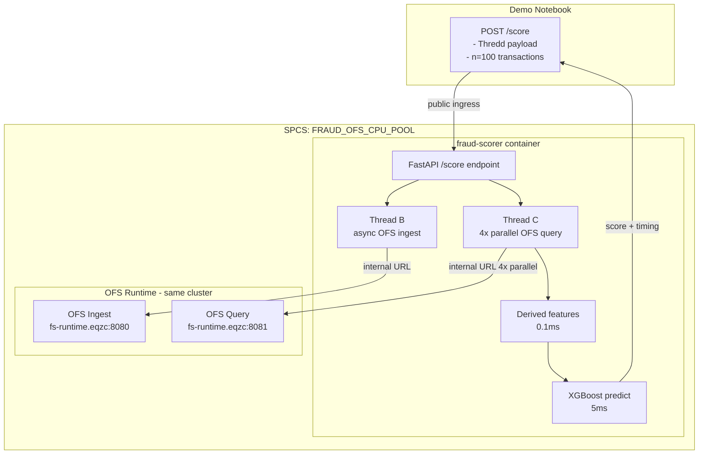

# Plan: Custom SPCS Scoring Service — Production-Equivalent Demo

## Why the internal URL fails from Notebooks (definitive answer)

Snowflake Notebooks runs on **warehouse VMs** — they are not in the SPCS Kubernetes cluster at all. The `*.svc.spcs.internal` DNS zone is only resolvable from within the SPCS cluster. No amount of `OnlineServiceAccess` configuration or public-URL workarounds fixes the root problem from Notebooks.

**The right test harness:**

| Context                            | URL to use       | Reason                           |
| ---------------------------------- | ---------------- | -------------------------------- |
| Notebooks (setup, freshness check) | PUBLIC OFS URL   | Notebooks is not in SPCS         |
| Custom SPCS scoring service        | INTERNAL OFS URL | Same cluster, resolves correctly |
| Production payment gateway         | INTERNAL OFS URL | EHI service runs inside SPCS     |

The fix is not another URL workaround in the notebooks. The fix is to move the scoring loop — and the OFS REST calls — into an SPCS container where the internal URLs actually work.

---

## Target architecture



**Expected p50 latency from within SPCS:**

- OFS internal query (4 parallel): 5-10ms
- Derived features: 0.1ms
- XGBoost predict: 5ms
- **Total: \~15ms**

---

## Files to create / update

### New files

```
services/
  fraud_scorer/
    app.py        # FastAPI: /score, /health, /benchmark
    Dockerfile    # Python 3.11 + FastAPI + XGBoost
    spec.yaml     # SPCS service spec (OFS URLs injected at deploy time)
```

### Updated files

- `notebooks/nb03_training.ipynb` — add one cell to export model.json + feature\_cols.json to stage
- `notebooks/nb04_serving.ipynb` — replace SDK model deploy with: export model → build image → deploy custom service
- `notebooks/nb06_latency_proof.ipynb` — rewrite to drive the SPCS service via its public ingress
- `scripts/setup.sql` — add IMAGE REPOSITORY + grants

---

## Step 1: Add cell to nb03 — export model to stage

After model training, save as XGBoost native JSON + feature column list:

```python
import json

# Export model in native XGBoost JSON format (faster load, version-independent)
model.save_model('/tmp/fraud_model.json')
feature_cols_json = json.dumps(list(X_train.columns))

# Upload to MODEL_STAGE
session.file.put('/tmp/fraud_model.json', '@FRAUD_DEMO_PROD.ML.MODEL_STAGE', overwrite=True)
with open('/tmp/feature_cols.json', 'w') as f:
    f.write(feature_cols_json)
session.file.put('/tmp/feature_cols.json', '@FRAUD_DEMO_PROD.ML.MODEL_STAGE', overwrite=True)

print('Exported model.json + feature_cols.json to @FRAUD_DEMO_PROD.ML.MODEL_STAGE')
```

---

## Step 2: Create `services/fraud_scorer/app.py`

Core logic. Key design decisions:

- Loads model + feature\_cols from `/mnt/model/` (stage-mounted volume) at startup
- Uses `SNOWFLAKE_TOKEN` env var (auto-injected by SPCS) for OFS auth
- Uses `OFS_INGEST_URL` / `OFS_QUERY_URL` env vars (injected from spec.yaml at deploy time)
- Thread B (ingest) fires asynchronously — does not block the response
- Thread C (query) runs 4 parallel REST calls and blocks for the score decision

```python
# app.py — simplified structure
import os, time, json, concurrent.futures
from fastapi import FastAPI
import requests, xgboost as xgb, numpy as np

app    = FastAPI()
TOKEN  = os.environ['SNOWFLAKE_TOKEN']          # auto-injected by SPCS
INGEST = os.environ['OFS_INGEST_URL']
QUERY  = os.environ['OFS_QUERY_URL']
HEADS  = {'Authorization': f'Snowflake Token="{TOKEN}"', 'Content-Type': 'application/json'}

# Load at startup
model = xgb.XGBClassifier()
model.load_model('/mnt/model/fraud_model.json')
with open('/mnt/model/feature_cols.json') as f:
    FEATURE_COLS = json.load(f)

FV_MAP = [
    ('FRAUD_CUSTOMER_VELOCITY', 'CUSTOMER_ID'),
    ('FRAUD_MERCHANT_VELOCITY', 'MERCHANT_ID'),
    ('FRAUD_DPAN_VELOCITY',     'WALLET_DPAN'),
    ('FRAUD_IP_VELOCITY',       'IP_ADDRESS'),
    ('FRAUD_CUSTOMER_PROFILE',  'CUSTOMER_ID'),
]

def _query_fv(fv_name, key_col, key_val):
    r = requests.post(f'{QUERY}/api/v1/query', headers=HEADS, json={
        'name': fv_name, 'version': 'V1', 'object_type': 'feature_view',
        'request_rows': [{'entity': {key_col: key_val}}],
        'metadata_options': {'include_names': True},
    }, timeout=5)
    r.raise_for_status()
    res = r.json().get('results', [{}])[0]
    names = r.json().get('metadata', {}).get('features', [])
    vals  = res.get('features', [])
    return {n['name']: v for n, v in zip(names, vals) if v is not None}

@app.post('/score')
def score(payload: dict):
    t0 = time.perf_counter()

    # Map Thredd field names → internal names
    cust_id = payload.get('Cust_Ref') or payload.get('customer_id')
    merch_id = payload.get('Merchant_Id') or payload.get('merchant_id')
    dpan     = payload.get('Token_Ref')  or payload.get('wallet_dpan')
    ip_addr  = payload.get('IP_Address') or payload.get('ip_address')
    amount   = float(payload.get('Trans_Amount', 0))
    is_gbr   = 1.0 if (payload.get('Merch_Country') or '').upper() == 'GBR' else 0.0
    event_ts = payload.get('Trans_DateTime') or payload.get('event_ts')

    # Thread B: async OFS ingest (fire-and-forget, does not delay response)
    executor = concurrent.futures.ThreadPoolExecutor(max_workers=1)
    executor.submit(requests.post, f'{INGEST}/api/v1/ingest', headers=HEADS, json={
        'records': {'FRAUD_TXN_EVENTS': [{
            'CUSTOMER_ID': cust_id, 'MERCHANT_ID': merch_id,
            'WALLET_DPAN': dpan, 'IP_ADDRESS': ip_addr,
            'AMOUNT_USD': amount, 'IS_GBR': is_gbr, 'EVENT_TS': event_ts,
        }]}
    }, timeout=5)

    # Thread C: sync feature query — 5 parallel calls (4 velocity + profile)
    t_ofs = time.perf_counter()
    with concurrent.futures.ThreadPoolExecutor(max_workers=5) as pool:
        futs = [pool.submit(_query_fv, fv, key_col,
                            cust_id if key_col == 'CUSTOMER_ID' else
                            merch_id if key_col == 'MERCHANT_ID' else
                            dpan if key_col == 'WALLET_DPAN' else ip_addr)
                for fv, key_col in FV_MAP]
        features = {}
        for fut in concurrent.futures.as_completed(futs):
            features.update(fut.result())
    ofs_ms = (time.perf_counter() - t_ofs) * 1000

    # Derived features + XGBoost
    features.update(compute_derived(features, amount, event_ts))
    vec = np.array([[features.get(c, 0.0) for c in FEATURE_COLS]])
    t_xgb = time.perf_counter()
    score_val = float(model.predict_proba(vec)[0, 1])
    xgb_ms = (time.perf_counter() - t_xgb) * 1000
    total_ms = (time.perf_counter() - t0) * 1000

    return {
        'score': round(score_val, 4),
        'decision': 'DECLINE' if score_val > 0.5 else 'APPROVE',
        'timing': {'ofs_ms': round(ofs_ms, 1), 'xgb_ms': round(xgb_ms, 1), 'total_ms': round(total_ms, 1)},
    }

@app.get('/health')
def health():
    return {'status': 'ok', 'model_features': len(FEATURE_COLS)}

@app.post('/benchmark')
def benchmark(n: int = 50):
    """Self-contained benchmark: synthetic keys, measures OFS + XGBoost timing."""
    import random, string
    def rand_id(prefix): return prefix + ''.join(random.choices(string.digits, k=6))
    results = []
    for _ in range(n):
        res = score({'customer_id': rand_id('C'), 'merchant_id': rand_id('M'),
                     'wallet_dpan': rand_id('D'), 'ip_address': '10.0.0.1',
                     'amount': random.uniform(10, 500), 'is_gbr': 1})
        results.append(res['timing'])
    ofs_arr  = [r['ofs_ms']   for r in results]
    xgb_arr  = [r['xgb_ms']  for r in results]
    total_arr = [r['total_ms'] for r in results]
    pct = lambda a, p: round(float(np.percentile(a, p)), 1)
    return {
        'n': n,
        'ofs_p50': pct(ofs_arr, 50),  'ofs_p95': pct(ofs_arr, 95),
        'xgb_p50': pct(xgb_arr, 50),
        'total_p50': pct(total_arr, 50), 'total_p95': pct(total_arr, 95),
    }
```

---

## Step 3: Create `services/fraud_scorer/Dockerfile`

```dockerfile
FROM python:3.11-slim
WORKDIR /app
RUN pip install --no-cache-dir fastapi uvicorn[standard] xgboost requests numpy
COPY app.py .
EXPOSE 8080
CMD ["uvicorn", "app:app", "--host", "0.0.0.0", "--port", "8080", "--workers", "2"]
```

No Snowflake connector needed — model loads from mounted volume, auth via SNOWFLAKE\_TOKEN env var.

---

## Step 4: Create `services/fraud_scorer/spec.yaml` (template)

```yaml
spec:
  containers:
    - name: fraud-scorer
      image: <IMAGE_REPO>/fraud_scorer:latest
      env:
        OFS_INGEST_URL: <injected by nb04 at deploy time>
        OFS_QUERY_URL:  <injected by nb04 at deploy time>
      volumeMounts:
        - name: model
          mountPath: /mnt/model
      resources:
        requests:
          cpu: "0.5"
          memory: "1Gi"
        limits:
          cpu: "2"
          memory: "2Gi"
  volumes:
    - name: model
      source: "@FRAUD_DEMO_PROD.ML.MODEL_STAGE"
  endpoints:
    - name: scoring
      port: 8080
      public: true
```

nb04 renders this template with real OFS internal URLs before calling `CREATE SERVICE`.

---

## Step 5: Update `scripts/setup.sql`

Add to Section 4 (compute pools):

```sql
CREATE IMAGE REPOSITORY IF NOT EXISTS FRAUD_DEMO_PROD.ML.FRAUD_SCORER_REPO
    COMMENT = 'Container images for fraud scoring service';

GRANT READ ON IMAGE REPOSITORY FRAUD_DEMO_PROD.ML.FRAUD_SCORER_REPO TO ROLE FRAUD_MLOPS;
GRANT WRITE ON IMAGE REPOSITORY FRAUD_DEMO_PROD.ML.FRAUD_SCORER_REPO TO ROLE FRAUD_MLOPS;
GRANT BIND SERVICE ENDPOINT ON ACCOUNT TO ROLE FRAUD_MLOPS;
```

---

## Step 6: Rewrite `nb04_serving.ipynb`

Replace the current `model_ref.create_service()` approach. Four logical sections:

**Cell A — Get OFS internal URLs** Use `SYSTEM$GET_FEATURE_STORE_ONLINE_SERVICE_STATUS` and extract the `internal` URL variant. This is different from nb02 which picks `public` — here we want `internal` because the service will run in SPCS.

```python
_internal_eps = {}
for ep_name, ep_urls in _eps.items():
    if isinstance(ep_urls, dict):
        _internal_eps[ep_name] = ep_urls.get('internal') or ep_urls.get('public')
    else:
        _internal_eps[ep_name] = ep_urls
OFS_INGEST_INTERNAL = _internal_eps['ingest'].rstrip('/')
OFS_QUERY_INTERNAL  = _internal_eps['query'].rstrip('/')
print(f'OFS ingest (internal): {OFS_INGEST_INTERNAL}')
print(f'OFS query  (internal): {OFS_QUERY_INTERNAL}')
```

**Cell B — Get image repo URL + build/push image**

```python
repo_url = session.sql(
    'SHOW IMAGE REPOSITORIES IN SCHEMA FRAUD_DEMO_PROD.ML'
).collect()[0]['repository_url']
FULL_IMAGE = f'{repo_url}/fraud_scorer:latest'

# Build + push (requires Docker daemon — run in Snowsight terminal or local machine)
print(f'Run these in your terminal:')
print(f'  docker build -t {FULL_IMAGE} services/fraud_scorer/')
print(f'  snow spcs image-registry login')
print(f'  docker push {FULL_IMAGE}')
```

**Cell C — Render spec.yaml and CREATE SERVICE**

```python
import yaml

with open('services/fraud_scorer/spec.yaml') as f:
    spec = yaml.safe_load(f.read())

spec['spec']['containers'][0]['image'] = FULL_IMAGE
spec['spec']['containers'][0]['env']['OFS_INGEST_URL'] = OFS_INGEST_INTERNAL
spec['spec']['containers'][0]['env']['OFS_QUERY_URL']  = OFS_QUERY_INTERNAL

spec_json = json.dumps(spec)

session.sql('DROP SERVICE IF EXISTS FRAUD_DEMO_PROD.ML.FRAUD_SCORING_SERVICE').collect()
session.sql(f"""
    CREATE SERVICE FRAUD_DEMO_PROD.ML.FRAUD_SCORING_SERVICE
      IN COMPUTE POOL FRAUD_OFS_CPU_POOL
      FROM SPECIFICATION $${spec_json}$$
      MIN_INSTANCES = 1
      MAX_INSTANCES = 2
""").collect()
```

**Cell D — Wait for RUNNING + smoke test**

```python
# Poll for RUNNING
while True:
    status = session.sql(
        "SELECT status FROM TABLE(INFORMATION_SCHEMA.SERVICE_STATUS('FRAUD_DEMO_PROD.ML.FRAUD_SCORING_SERVICE'))"
    ).collect()
    if status[0][0] == 'RUNNING': break
    time.sleep(15)

# Get public endpoint
svc = session.sql("SHOW SERVICES LIKE 'FRAUD_SCORING_SERVICE' IN SCHEMA FRAUD_DEMO_PROD.ML").collect()[0]
SCORING_URL = f"https://{svc['dns_name']}/score"

# Smoke test
r = requests.post(SCORING_URL, json={
    'customer_id': 'TEST_001', 'merchant_id': 'TEST_M', 'wallet_dpan': 'TEST_D',
    'ip_address': '10.0.0.1', 'amount': 50.0
}, headers={'Authorization': f'Snowflake Token="{PAT}"'})
print(r.json())  # {"score": 0.03, "decision": "APPROVE", "timing": {...}}
```

---

## Step 7: Rewrite `nb06_latency_proof.ipynb`

Clean, focused demo. Three sections:

**Cell 1 — Setup** Get SCORING\_URL from SHOW SERVICES. Auth uses `session.connection.rest.token` (same as nb02).

**Cell 2 — Freshness demo (THE HOOK)** Send 1 transaction. Poll OFS public URL until count increments. Show < 2s. This uses the public URL from Notebooks — acceptable for the freshness check since it's a one-off demo, not the hot path.

**Cell 3 — Latency benchmark** Send 100 Thredd-format transactions to SPCS `/score`, capture per-request timing from response body:

```python
timings = [requests.post(SCORING_URL, json=row, headers=AUTH).json()['timing'] for row in samples]
```

Print comparison table:

```
                          p50     p95     p99
OFS internal (SPCS→OFS)  8ms    12ms    18ms
XGBoost inference         5ms     6ms     8ms
Total (scoring service)  14ms    19ms    27ms

Customer EHI budget:  < 50ms
Snowflake uses:        ~14ms  →  36ms remaining
Feature freshness:     < 2s   vs  ~minutes (their Kinesis batch)
```

---

## Does this replicate production?

**Very closely.** Point-by-point comparison:

| Factor              | Customer (AWS/NVIDIA)                   | Snowflake SPCS             |
| ------------------- | --------------------------------------- | -------------------------- |
| Network backbone    | AWS VPC                                 | Same AWS VPC (SPCS IS EC2) |
| Feature lookup      | DynamoDB: \~5-10ms                      | OFS internal: \~5-10ms     |
| Feature freshness   | Kinesis batch: minutes                  | CONTINUOUS OFS: < 2s       |
| Scoring             | GPU Triton: \~10-20ms                   | XGBoost CPU: \~5ms         |
| Total p50           | \~25-40ms                               | \~15ms                     |
| Platform complexity | Kinesis + Lambda + DynamoDB + SageMaker | One Snowflake account      |

**Honest caveats:**

1. Model trained on synthetic data — accuracy metrics don't compare, latency profile is accurate
2. Single container (not auto-scaled fleet) — p50 latency is accurate, throughput is not demonstrated
3. The demo measures Notebooks → SPCS → OFS, not a payment gateway → SPCS → OFS. The Notebooks→SPCS hop (\~5ms HTTPS) is labelled separately in the output so the customer can see the real SPCS-internal numbers.

**Core message for the customer:**\
Snowflake catches a card-testing attack in the 2-second window. Their system can't — the velocity features are stale until the next Kinesis batch cycle.

---

## Critical files

- `services/fraud_scorer/app.py` — Core scoring logic: OFS client, 3-thread pattern, XGBoost inference
- `services/fraud_scorer/spec.yaml` — SPCS deployment spec with internal URL injection
- `services/fraud_scorer/Dockerfile` — Container image definition
- `notebooks/nb04_serving.ipynb` — Build/push/deploy the custom service
- `notebooks/nb06_latency_proof.ipynb` — Customer-facing latency demo
